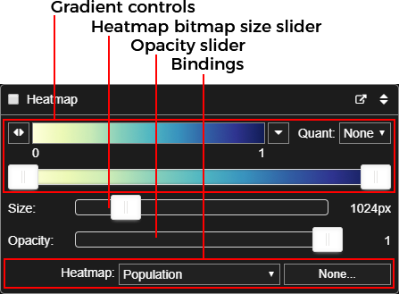

=====================================
Layer, gradient, and binding controls
=====================================

This topic describes the controls available in |VT| to manage separate visualization layers,  define
the color gradients used to represent data, and control how data is bound to different visual
elements in the Geospatial client.

.. contents:: Contents
   :local:

.. _layercontrols:

Layer controls
==============

All layer control sections have a title bar.

The title bar has a **Layer toggle** checkbox that controls the layer's
visibility, a layer title, and an **Expand/contract** button to reduce the control
block down to just the title bar.

Nodes layer
-----------

The nodes layer controls affect the visual representation of a simulation's
nodes. The layer provides a set of bindable visual parameters that let you drive
the visuals using the inputs and outputs of the simulation. For example, you
could bind the visual size of the node to the population in that node, so that
more populous nodes have larger dots.

The nodes layer controls differ slightly depending on whether the :term:`visset`
specifies :term:`points` or :term:`shapes` node representations. Both are shown here.

   Nodes layer controls for points (left) and shapes (right)

Here we'll examine the parts that make up the nodes layer controls.

.. figure:: images/vt-nodes-controls.png

The first section are the controls for the color gradient. (See
:ref:`gradients`.)

Below that is the **Scale** slider, which uniformly scales the size of the nodes in
the visualization. Increasing the scale can help if nodes are too small or don't
stand out enough against the base map. It is also valuable when using shape
nodes (which are sized in meters) while zoomed way out.

The last section are the **Binding** controls, which link simulation data channels
with visual parameters. Usage of the Binding controls is discussed below in
:ref:`bindings`, but the visual parameters that can be controlled for nodes are
as follows (separately for *points* and *shapes*).

Points visual parameters
~~~~~~~~~~~~~~~~~~~~~~~~

=================== ============================================================
Parameter           Description
=================== ============================================================
Color               Controls node fill color as a color string, like "red" or
                    "#00ff00".
Opacity             Controls the node's opacity, which has a numeric range from
                    zero to one.
Outline color       Controls the color of the outline around the filled node, as
                    a color string like "red" or "#00ff00".
Outline thickness   Controls the thickness of the outline around the
                    filled node as a numeric non-negative value in pixels.
Size                Controls the size of the filled node point, as a
                    non-negative value in pixels.
=================== ============================================================

For more information about bindings see :ref:`bindings`.

Shapes visual parameters
~~~~~~~~~~~~~~~~~~~~~~~~

=================== ============================================================
Parameter           Description
=================== ============================================================
Color               Controls node fill color as a color string, like "red" or
                    "#00ff00".
Extrusion           Controls the extruded height of the node rectangle from the
                    surface of the earth, as a numeric non-negative value in
                    meters.
Opacity             Controls the node shape's opacity, which has a numeric range
                    from zero to one.
Size                Controls the size of the filled node shape, as a
                    non-negative value in pixels.
=================== ============================================================

For more information about bindings see :ref:`bindings`.

Heatmap layer
-------------

The heatmap layer provides a way to show aggregated data by populating a heatmap
image from simulation data then overlaying that onto the map. It makes sense for
any data that aggregates well, such as populations of humans or vectors. It also
can be useful for just finding which nodes have certain characteristics, such as
prevalence or infected humans/vectors.

The first section are the controls for the color gradient. (See
:ref:`gradients`.)

The **Size** slider controls the image resolution of the bitmap overlay image. A
larger value here increases the spatial resolution of the heatmap at the expense
of memory and animation speed. The default is 1024 pixels in the longest
dimension, which is a good trade-off between the two.

    Heatmap at 1024 px (left) and 4096 px (right)

The opacity slider allows you to adjust the overall transparency of the heatmap
layer. To hide the layer entirely, use the layer checkbox in the title bar
rather than setting opacity to zero.

.. note::

    There is a known bug in |VT| that can occur if you run long animations with
    the heatmap layer turned on, and this problem is exacerbated by large
    values of the size slider. The underlying Cesium mapping library may run
    out of memory, causing a "rendering has stopped" error message. Until this
    problem is resolved, avoid very long runs of animation with the heatmap
    layer visible.

The last section are the **Binding** controls, which links a simulation data channel
to the heatmap. For more information, see :ref:`bindings`.

Animation layers
----------------

Animation layers are generated in the |VT| preprocessing scripts. Examples of
animation layers are marker layers and infected human migration. You can have as
many animation layers as you want, although showing a large number of them may
affect animation performance.

Animation layers themselves don't have any controls except for their visibility
checkbox. In the case of marker layers, the layer title also acts as a legend
by showing the layer's assigned symbol and color.

.. _gradients:

Gradient controls
=================

The Geospatial client has a standard set of controls for color gradients that
are used in both the nodes and heatmap layer controls. This section describes
the gradient controls in detail.

The **Gradient preview** shows the currently selected gradient. To the left of
the preview is the **Gradient menu** button. Clicking this button shows the
gradient menu.

    The gradient menu

The gradient menu shows the available gradients, divided into categories
related to their intended use. Notable among these are many gradients sourced
from the site `Color Brewer 2.0 <http://colorbrewer2.org>`_ which is favored
in many academic circles. Within the menu, the currently selected gradient's
name is highlighted in dark blue.

.. note::

    You are not limited to using the gradients provided in the |VT| gradients
    menu. In the preprocessing step, you can install custom gradients into both
    the node and heatmap controls using a simple text gradient language. The
    syntax for a text gradient is::

        <color>@0,[<color>@<loc>,...]<color>@1[,r][,q<quant>]

    Where:

        * ``<color>`` is an `SVG color <https://www.w3.org/TR/SVG/types.html#ColorKeywords>`_
          like "red" or "lime" or an HTML/CSS-style color in the form "#rrggbb"
          like "#ff0000". The color may also optionally contain a transparency
          component (alpha) in the form "rrggbbaa", e.g. "#ff00007f", which
          represents red with 50% transparency.

        * ``<loc>`` is the color stop location as a number in the range [0, 1]. The
          locations must increase monotonically from 0 to 1, and color stops at 0
          and 1 are required.

        * the optional ``,r`` reverses the gradient.

        * the optional ``,q<quant>`` quantizes the gradient, where <quant> is an
          integer of 2 or more.

    Examples:

    .. list-table::
       :widths: 40 400
       :header-rows: 1

       * - Gradient
         - Text spec
       * - .. figure:: images/vt-gradient-intensity.png
         - ``"#006600@0, #00ff00@0.25, #ffff00@0.5, #ff0000@1"``
       * - .. figure:: images/vt-gradient-intensity-r.png
         - ``"#006600@0, #00ff00@0.25, #ffff00@0.5, #ff0000@1, r"``
       * - .. figure:: images/vt-gradient-intensity-q5.png
         - ``"#006600@0, #00ff00@0.25, #ffff00@0.5, #ff0000@1, r, q5"``
       * - .. figure:: images/vt-gradient-deepsea.png
         - ``"black@0, #183567@0.25, #2e649e@0.5, #17adcb@0.75, #00fafa@1"``
       * - .. figure:: images/vt-gradient-flux.png
         - ``"aqua@0, #f2ff00@0.5, #fe00fe@1"``
       * - .. figure:: images/vt-gradient-with-alpha.png
         - ``"#00000000@0,#00ff007f@0.25,#ffff00ff@.5,#ff0000ff@1"``
           (Example uses alpha.)

    To install a text gradient spec for use by nodes, you'd add a line to your
    preprocessing script like::

        vis_set.options["nodeVis"]["gradient"] = "black@0,red@1"

    or for the heatmap, like::

        vis_set.options["heatmapVis"]["gradient"] = "black@0,red@1"

To the right of the gradient preview is the **Gradient reverse** button. It
reverses the order and position of all the color stops in the current gradient.

On the far left of the top row is the **Quantization menu** that lets you quantize the gradient to a
discrete subset of its colors. This can be useful in identifying contours in heatmaps, for example.

    Gradient quantization applied to a heatmap

At the bottom of the gradient controls is the **Gradient range** slider. This
slider allows you to compress the range over which the heatmap's gradient will
show full range. For example, for data ranging from 0 to 1, setting the left
slider thumb to 0.2 means that any values less than or equal to 0.2 will show
the leftmost gradient color. Likewise, setting the right slider thumb to 0.8
means that any value greater than or equal to 0.8 will show rightmost color.

.. _bindings:

Binding controls
================

The Geospatial client has a standard set of controls for binding simulation data
sources to visual parameters within the client. This section examines how such
bindings are made and modified.

The following figure shows the binding section for the *points* representation
of nodes.

.. figure:: images/vt-binding-block.png

An example will be instructive. You can follow along with this example by
running the Python web server (see :ref:`server`) and loading this URL::

    http://localhost:8000/vistools/geospatial.html?set=/zambia_data/Vis-Tools/binding_tutorial/visset.json

Observe that the binding for the visual parameter **Size** looks like this:

To bind simulation data to a visual parameter, first choose one of your
simulation data sources from the source menu.

* On the Size binding row, click the source menu and choose "Population"

Note that the nodes are now sized according to their population. In fact, the
node size in pixels is *exactly* the population, which seemingly works well in
this example, but if a node had a population of 1,000, it would obliterate all
the nodes around it. Also, some of the nodes have populations of zero or one,
so they are too small or disappear entirely. We'll fix these problems next.

Also note that if you scrub around on the timeline, you will see the node sizes
changing, because we have bound a time-varying simulation output. Thus you are
visualizing the node populations changing due to births, deaths, and migrations.

For the next step, click the function button (currently labeled **None**) next
to the source menu.

Clicking that button will bring up the **Edit function** dialog box.

The **Edit function** dialog box has a top section of information, and a function text
box below where we can enter some text. The information line entitled **Source**
shows that we've bound **Size** to the **Population** simulation output, and also shows
us that the range of that data is [0, 46], meaning from 0 to 46 inclusive. (That
data range is calculated over all nodes and all timesteps.)

Enter the following (exactly as shown) into the **Function** text box::

    scale(3, 20)

The function scale(3, 20) means "normalize the input value to the range [0, 1],
then scale it into the range [3, 20]". Now click **OK** to install the
new function.

Note that now the nodes range from 3 to 20 pixels in size based on their
population.

|VT| has a useful set of built-in functions for your use, as well as the ability
to use custom user-defined functions. See :doc:`geospat-functions`.
