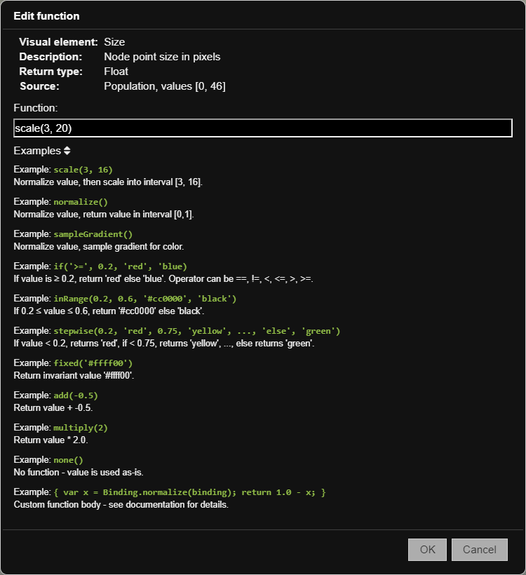

===================
Functions reference
===================

Much of the power of the |VT| :term:`Geospatial client` is afforded by the ability to
perform real-time functional manipulation of simulation values when applying
those values to visual parameters of the visualization.

.. contents:: Contents
   :local:

Built-in functions
==================

The |VT| Geospatial client contains a healthy set of built-in functions that
cover many of the kinds of manipulations you're likely to want to carry out.
An easy way to remember these functions is to use the built-in **Examples** toggle
in the **Edit function** dialog box itself.

add()
-----

Adds the constant value *x* to the input value. Note that *x* may
be negative.

**add(x)**

* :math:`value \leftarrow value + x`
* x: number, constant to be added to the input value.
* returns: number, input value plus constant *x*.

**Examples**

* add(4.5) returns value + 4.5.
* add(-1) returns value - 1.

fixed()
-------

Ignores the input value and returns *x* directly. This function
can be used even if there is no input source selected to force a particular
value for a visual parameter. For example, binding point node size to "None"
with the function "fixed(10)" makes all nodes ten pixels in size.

Note that *x* may be a string or a number. For example, if you are using fixed in
a binding to a color visual parameter, return a valid color string. For example,
"fixed('red')" or "fixed('#00ff00')".

**fixed(x)**

* :math:`value \leftarrow x`
* x: number or string, value with which to override input value.
* returns: same as argument, exactly *x*.

**Examples**

* fixed(5.5) returns 5.5.
* fixed("yellow") returns "yellow".

if()
----

Performs an inline conditional on the input value and returns
either thenValue or elseValue. This function is similar to the ternary ``?:``
operator in many C-like languages.

**if(op, compArg, thenValue, elseValue)**

* :math:`value \leftarrow \begin{cases} thenV\!alue & value\:op\:\:compArg\\ elseV\!alue & otherwise \end{cases}`
* op: string, comparison operator - one of "==", "!=", "<", "<=", ">", or ">=".
* compArg: number or string, comparison argument, i.e. value <op> <compArg>.
* thenValue: number or string, value to return if condition is true.
* elseValue: number or string, value to return if condition is false.
* returns: number or string (depending on type of *thenValue* or *elseValue*),
  *thenValue* if condition is true; otherwise, *elseValue*.

**Examples**

* if(">=", 0.8, "red", "green") returns "red" if input value is >= 0.8, else
  "green".
* if("<", 0, -1, 1) returns -1 if value is negative, otherwise 1 (equivalent to
  the sgn(x) function in some languages).

inRange()
---------

Tests whether the input value is in the range [low, high]
(inclusive), and returns thenValue if so; otherwise, returns elseValue.

**inRange(low, high, thenValue, elseValue)**

* :math:`value \leftarrow \begin{cases} thenV\!alue & low \le value \le high\\ elseV\!alue & otherwise \end{cases}`
* low: number, low constant for range comparison, inclusive.
* high: number, high constant for range comparison, inclusive.
* thenValue: number or string, value to return if input value is in range.
* elseValue: number or string, value to return if input value is out of range.
* returns: number or string (depending on type of *thenValue* or *elseValue*),
  *thenValue* if value is in range; otherwise, *elseValue*.

**Examples**

* inRange(0.1, 0.4, "green", "red") returns "green" if input value >= 0.1 and
  <= 0.4, otherwise "red".
* inRange(-5, 0, -1, 1) returns -1 if value is in range [-5, 0], otherwise 1.

multiply()
----------

Multiplies the input value by the constant *x*. Note that *x* may
be negative or a non-integer.

**multiply(x)**

* :math:`value \leftarrow value \times x`
* x: number, constant to be multiplied with the input value.
* returns: number, value * x.

**Examples**

* multiply(2) returns value x 2.
* multiply(0.5) returns value / 2.
* multiply(-1) returns -value.

none()
------

Passes the input value through untouched.

**none()**

* :math:`value \leftarrow value`
* returns: same type as input value, input value untouched.

**Examples**

* none() returns the input value as-is.

normalize()
-----------

Calculates a normalized form of the input value, based on the
range of the input data channel for *all timesteps* and *all nodes*, returning
a value in the range [0, 1].

**normalize()**

* :math:`value \leftarrow norm(value)`
* returns: a normalized value [0, 1] for the input value.

**Examples**

* normalize() returns the normalized input value.

sampleGradient()
----------------

Returns a color by normalizing the input value then sampling the
color gradient. This function only make sense for bindings to color visual
parameters.

**sampleGradient()**

* :math:`value \leftarrow sampleGradient(norm(value))`
* returns: color, gradient sampled with normalized value.

**Examples**

* sampleGradient() returns a color based on the normalized input value.

scale()
-------

Returns a value mapped into the given range. The range is treated
inclusively.

**scale(min, max)**

* :math:`value \leftarrow min + norm(value) \times (max - min)`
* min: number, minimum value in output range inclusive
* max: number, maximum value in output range inclusive
* returns: number, value mapped into [min, max]

**Examples**

* scale(3, 20) returns a value between 3 and 20 inclusive that represents the
  input value within that range.
* scale(-1, 1) returns a value between -1 and 1 inclusive that represents the
  input value within that range (i.e :math:`0 \rightarrow -1, 0.5 \rightarrow 0, 1 \rightarrow 1`).

stepwise()
----------

Returns a stepwise value. It can be used to create custom stepwise
gradients or specialized quantizations.

**stepwise(step1, firstValue, step2, secondValue, ..., "else", elseValue)**

* :math:`value \leftarrow \begin{cases} firstV\!alue & value < step1\\ secondV\!alue & value < step2\\ ... & ...\\ elseV\!alue & otherwise \end{cases}`
* step1: number, first step argument, where *firsValue* will be returned if
  input value is less than step1.
* firstValue: number or string, result to be returned if input value is less
  than *step1*.
* step2: number, second step argument, where *secondValue* will be returned if
  input value is less than step2.
* secondValue: number or string, result to be returned if input value is less
  than *step2*.
* ...: more step/value pairs.
* "else": string, the explicit string "else".
* elseValue: number or string, result to be returned if input value is greater
  than or equal to the last step.
* returns: number or string, value for matching step; otherwise, *elseValue*.

**Examples**

* stepwise(0.2, 'red', 0.75, 'yellow', 'else', 'green') returns the string
  red for input values less than 0.2, the string "yellow" for values between 0.2
  and 0.75, and "green" otherwise.
* stepwise(0.25, 0, 'else' 1) quantizes input values < 0.25 to 0, otherwise 1.

Custom functions
================

While for most cases the |VT| built-in functions will suffice, it is possible to
use custom user-defined functions for special cases. This section examines that
capability in detail.

Simple example
--------------

What if we wanted to invert a normalized value? The value naturally ranges from
0 to 1, but we want it to be the other way around, i.e. :math:`1 - value`. None
of the built-in functions can do that. However, that result and many more can
be achieved using a *custom function* which is essentially a specialized
JavaScript function body. Consider this custom function:

.. code-block:: JavaScript

    { return 1.0 - binding.value; }

That function carries out the desired function. It is simple enough, except
for the *binding* reference, which is explained below.

Basic syntax
------------

As might be inferred from the previous example, the basic syntax of a custom
function is:

.. code-block:: JavaScript

    { return <expression>; }

A custom function is the text of a JavaScript function body that will be
executed for each node, for each timestep, before a value is applied to the
bound visual parameter. The expression can be anything, but typically it is
some manipulation of the input value or other available data. The input data
and other information are provided to the custom function as an implicit
argument called *binding*.

.. note::

    Your custom function must be valid JavaScript. If it is not, or the code
    in the function throws an exception, you'll see an error message in the
    message area of the client window.

.. note::

    The code for your custom function may be arbitrarily complex. You can
    declare and use local variables, and use as many statements as you want.
    The custom function is evaluated as a real JavaScript function, and as long
    as it ultimately returns a valid return value, it will work. But be warned
    that your custom function is going to be executed *for every node, on every
    timestep*, so complex custom functions will detrimentally affect
    animation framerate.

The binding object
------------------

The binding object is passed to a custom function and provides access to the raw
bound simulation data channel value, along with other potentially useful data.

Here are the most commonly used data members of the binding object.

============== ========= =======================================================
Field          Type      Description
============== ========= =======================================================
value          number    The raw data value of the bound data source for the
                         current node and timestep.
min            number    The minimum value for this data channel over all nodes
                         and timesteps. Along with **max**, can be used to calculate
                         a normalized value.
max            number    The maximum value for this data channel over all nodes
                         and timesteps. Along with **min**, can be used to calculate
                         a normalized value.
============== ========= =======================================================

The binding object is implicitly available to your custom function, so to use
*min* you simply type :code:`binding.min` within your custom function. For
example, the following function normalizes the input value, which is
functionally equivalent to the built-in :code:`normalize()` function:

.. code-block:: JavaScript

    { return (binding.value - binding.min) / (binding.max - binding.min); }

The above fields are enough to do most numerical manipulations of the input
value. There are, however, some additional data members that may be of use for
other specialized functions.

============== ========= =======================================================
Field          Type      Description
============== ========= =======================================================
gradient       Gradient  The color gradient object for this binding. To use
                         this object, calculate a normalized value, then:

                         .. code-block:: JavaScript

                             return gradient.sampleHashCss(normValue);

                         which returns a color string like "#00ff00".
gradientLow    number    The low value of the gradient range slider, which
                         is a number in the range [0, gradientHigh). You
                         may choose to incorporate this into your function
                         if you are sampling the gradient directly.
gradientHigh   number    The high value of the gradient range slider, which
                         is a number in the range (gradientLow, 1]. You
                         may choose to incorporate this into your function
                         if you are sampling the gradient directly.
node           Node      An object describing the current node. This object
                         has the following potentially valuable fields.

                         * latitude: number, latitude in degrees.
                         * longitude: number, longitude in degrees.
                         * altitude: number: altitude in meters.
                         * nodeId: number or string: node ID from the
                           demographics file.

                         * other NodeAttribute fields added during the
                           preprocessing step, such as InitialPopulation,
                           BirthRate, etc.
timestep       number    Current timestep, in the range [0, timestepCount).
timestepCount  number    Number of timesteps in the present simulation.
============== ========= =======================================================

More examples
-------------

Here are some more examples of things you can do with custom functions.

* For *point* nodes, to outline a particular node of interest (id 340, for
  example), bind:

    * Outline color to:

        .. code-block:: python

            fixed("red")

    * Outline thickness to:

        .. code-block:: JavaScript

            { return (binding.node.nodeId == 340) ? 3 : 0; }

* To invert a normalized value, use the function:

    .. code-block:: JavaScript

        { return 1.0 - binding.value; }

* To apply a log scale to a value, use the function:

    .. code-block:: JavaScript

        { return Math.log10(binding.value); }

* To apply a square root to a value, use the function:

    .. code-block:: JavaScript

        { return Math.sqrt(binding.value); }

* To apply a random color to each node, bind node Color to the function:

    .. code-block:: JavaScript

        { return Gradient.presets["Hue"].sampleHashCss(Math.random()); }
