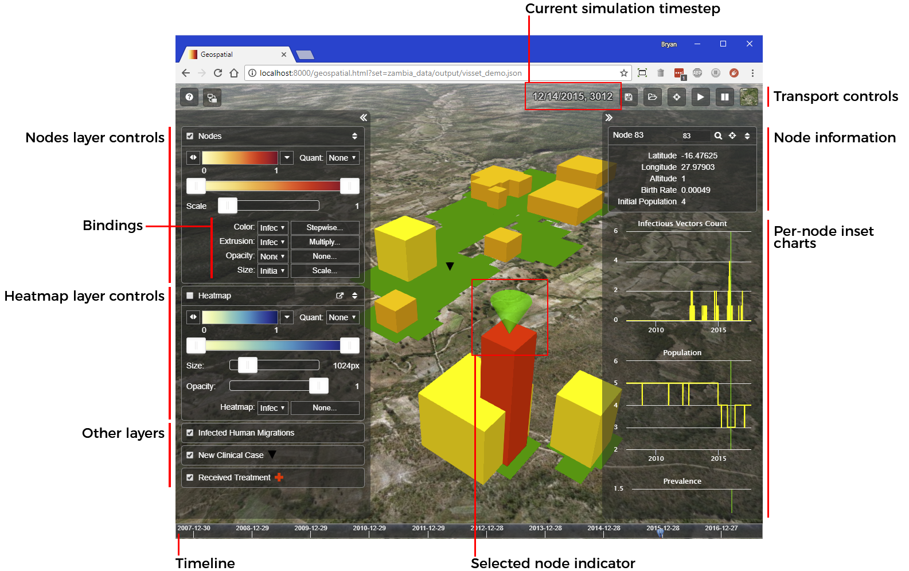
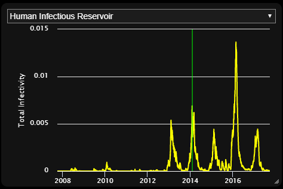

==================
Interface overview
==================

This topic describes the user interface elements in the |VT| Geospatial client.
The Geospatial client provides both data visualization and a user interface for
manipulating various aspects of the visual presentation. It is built for both
experimentation and presentation. Here's an overview of the window's parts:

.. note::

    The figure above shows a :term:`visset` that uses the *shapes* node representation.
    Some aspects of the window will differ for vissets that use "points"
    representation, which are noted later. For more information about the
    two node representations, see :ref:`points-shapes`.

.. note::

    You can make the browser window any size you like, including full screen for
    presentation purposes. Note that the bigger the window, the harder that your
    computer's GPU will have to work to render animation frames, so you may see
    a degradation in animation performance for large windows. You can also make
    the window smaller to make room for other windows on your computer, but
    below 1024 x 768, some user interface elements may start to overlap.

.. contents:: Contents
   :local:

Manipulating the globe
======================

The Geospatial client is built atop the excellent open-source
`Cesium <http://cesiumjs.org>`_ global mapping package, and follows the
conventions set forth by that package for manipulation of the globe itself.

The Geospatial client will automatically fly to your simulation's nodes when
it is first launched, but you will likely find yourself moving around the map
using these mouse gestures.

Top-row controls and message area
=================================

The top of the window contains some fundamental sections.

The **Message area** shows informational and error messages. The **Date &
timestep** area shows the date and timestep number of the current location in
the timeline. (The timeline itself is not shown in the figure. It is located at the
bottom of the Geospatial client window. See :ref:`timeline`.)

.. note::

    The timestep-to-date mapping is under the control of your preprocessing
    script. Preprocessing scripts generated by ``survey`` will by default choose
    a simulation start date such that the simulations ends at the date the
    preprocessing script itself is run. To override this behavior, you can set
    the start date in the visset by adding a line to your preprocessing script::

        vis_set.set_start_date("2014-09-30")

To the right of those areas are some buttons with the following functions:

.. list-table::
   :widths: 40 400
   :header-rows: 1

   * - Button
     - Description
   * - .. figure:: images/vt-help-button.png
     - **Help**. This button shows the built-in help dialog box with a subset of the
       information in this documentation.
   * - .. figure:: images/vt-comps-button.png
     - **COMPS**. This button, which is only present if the simulation has a
       |COMPS_s| sim ID, returns to the |COMPS_s| explore view for the present
       simulation.
   * - .. figure:: images/vt-save-button.png
     - **Save**. This button saves the current visualization settings for the
       Geospatial client to a file on your local computer.
   * - .. figure:: images/vt-load-button.png
     - **Load**. This button lets you reload a set of visualization settings
       you previously saved with the **Save** button.
   * - .. figure:: images/vt-chart-button.png
     - **Aggregate inset charts**. This button, which is only present if an inset
       chart file is specified in the preprocessing script, toggles the
       visibility of the aggregate inset chart panel.
       See :ref:`aggregateinsets`.
   * - .. figure:: images/vt-recenter-button.png
     - **Recenter**. This button causes the Geospatial client to recenter the view
       onto the bounding box of your nodes, looking straight down.
   * - .. image:: images/vt-play-button.png
       .. image:: images/vt-pause-button.png
     - **Play/Pause**. This button starts/stops animation playback of the
       simulation's data. How fast the playback advances depends critically on
       the number of nodes, timesteps, and layers being displayed.
   * - .. figure:: images/vt-pause-button.png
     - **Pause**. This button pauses playback of the simulation animation.
   * - .. figure:: images/vt-basemap-button.png
     - **Base map**. This button, which is part of the underlying Cesium mapping
       package, allows you to choose a base map layer from a list of available
       base maps, some of which are satellite-based, and others cartographic.

.. note::

    The base map menu is provided by the underlying Cesium mapping library.
    Along with setting the base map layer, the menu also provides the ability
    to display 3D terrain, which is turned off by default. While you can enable
    terrain in the Geospatial client, most of the visualization will become
    invisible, because it will be at 0 meters altitude, and thus rendered
    *beneath* the terrain. Therefore you should generally stick to the
    "WGS Ellipsoid" terrain map, which is a plain ellipsoid approximation of
    the Earth.

.. _timeline:

Timeline
========

At the very bottom of the window is the **Timeline**.

The timeline is a part of the Cesium mapping package. The blue **Current time
indicator** shows the current date in the simulation, and the range of dates in
the data. You can drag the indicator with the mouse to "scrub" time, updating
the visualization as you drag.

Side panels
===========

The window has two retractable panels on the left and right. Both panels share
some common elements, as shown here.

The **Expand/retract** button lets you show or hide the panel with a single click.
When the panel is expanded, you can also resize it by dragging the inside edge.

Left panel
----------

The left panel contains controls for showing and hiding the various layers that
have been created in the preprocessing step, and controlling their appearance.
The exact set of elements in this panel varies depending on the simulation and
preprocessing script.

The controls for each layer type are described in detail below. See
:ref:`layercontrols`.

Right panel
-----------

The right panel contains the per-node inset charts, node information, and node
search area. The inset charts and node information are only available when a
node is selected (by clicking on the node on the map).

To search for a particular node, type the node ID into the search box and
click the magnifier search button. The node's information and charts will be
shown, and the view will pan to center the found node.

.. _aggregateinsets:

Aggregate inset charts
======================

If an inset chart file is specified in the preprocessing script (see
:ref:`insetchart`), the inset panel and toggle button will be available. This
panel shows any one of the aggregate channels from the simulation's output. To
change the channel, use the channel select control at the top of the window.

Per-node inset charts
=====================

The right panel in the |VT| Geospatial client shows information and inset charts
for the selected node.

To select a node, click on its node point or shape. To deselect, click anywhere
on the map where there is no node.

When a node is selected, a selection indicator will appear on it. The appearance
of the selection indicator is different for *points* and *shapes* nodes.

    Selected point node (left), and shape node (right)

The number and content of per-node inset charts depends on the spatial reports
in the associated visset. The panel will scroll if necessary.

The green line in the chart indicates the current timestep. To seek the
visualization to a different timestep, you can click directly in any graph.

.. note::

    The color of the chart traces and the current-time bar can be customized
    in the |VT| preprocessing step.

Keyboard shortcuts
==================

The |VT| Geospatial client has some keyboard shortcuts that can be useful when
experimenting with settings or during presentation. For elements with a tooltip
(such as buttons), the keyboard shortcut is shown in the tooltip.

============== =================================================================
Key            Function
============== =================================================================
?              Toggle the built-in help panel.
E              Toggle the right panel open/closed.
F              Toggle flat (equirectangular) map projection.
I              Toggle the aggregate inset chart panel (if present) open/closed.
L              Equivalent to clicking the Load settings button.
P              Toggle presentation mode - show/hide all onscreen controls.
R              Recenter the map onto the nodes bounding box.
S              Equivalent to clicking the Save settings button.
W              Toggle the left panel open/closed.
1 - 9          Toggle the visibility of layers. "1" toggles Nodes, "2" toggles
               Heatmap, and subsequent numbers toggle whatever animation layers
               are present in the order they appear.
Space          Play/pause timeline animation.
Home           Seek time bar to beginning of simulation.
End            Seek time bar to end of simulation.
Left arrow     Step backward in time (4 hours by default).
Shift-left     Step backward in time by one full timestep.
Right arrow    Step forward in time (by four hours by default).
Shift-right    Step forward in time by one full timestep.
============== =================================================================

.. note::

    The amount of time by which the arrow keys advance/retard time can be set
    during the |VT| preprocessing step.

