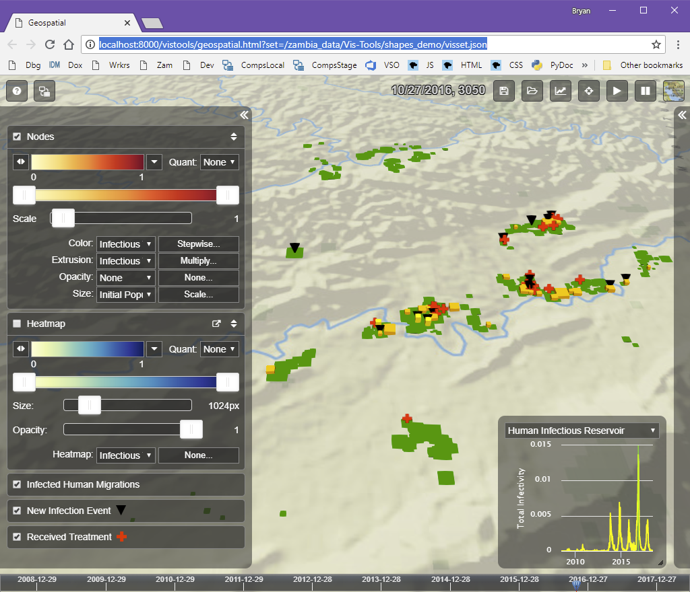
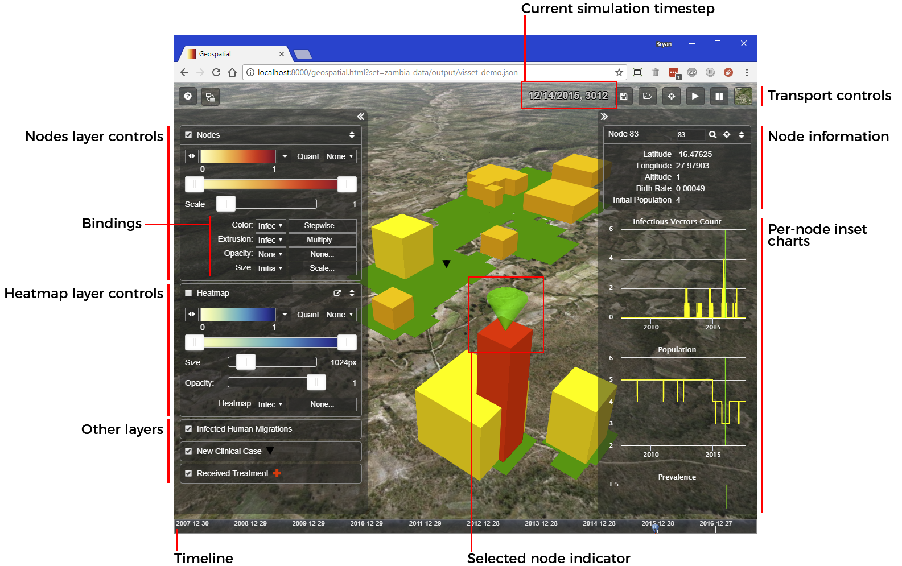

=======================
Running |VT| Standalone
=======================

This page walks you through the the steps to download and install |VT|, start
the local web server that serves the visualizations, and trying out a sample
visualization included with the installation.

Download
========

.. Bites that you can't put a variable in a link.

Download the |VT| archive from
`Vis-Tools Distribution
<https://github.com/InstituteforDiseaseModeling/Vis-Tools/>`_ on GitHub.

Unzip
=====

The first part of |VT| installation a matter of unzipping this distribution ZIP
file to a convenient location, such as your computer's desktop.

#.  Right-click the |VT| zip file.
#.  Select **Extract All** from the context menu.
#.  In the **Extract Compressed (Zipped) Folders** dialog box, use the
    **Browse** button to browse to the desired location on your computer's local
    hard drive.
#.  Click **Extract**.

.. note::

    |VT| will not work if installed to a network UNC path (that is, a path
    starting with "\\\\".

.. note::

    It is highly recommended that you install |VT| to a *local* drive location.
    |VT| will work when installed on a mapped network drive, but performance
    will be impacted.

Install ``vis_tools`` Python package
====================================

|VT| preprocessing is taken care of by classes in the included ``vis_tools``
Python package.

#.  Choose Start > Command Prompt to get a cmd.exe command prompt window
#.  Change directory to the location where you unzipped the |VT| distribution
    zip file.
#.  Run the command::

      python setup.py install

    That command will install the prerequisite packages and the ``vis_tools``
    package itself.

#.  Verify installation of the package by running the command::

      survey --help

    Which will show the options for the built-in ``survey`` program, which makes
    default preprocessing scripts for you.

Prepare the Geospatial client
=============================

The |VT| client uses several third-party libraries that are not included with
the distribution.

#.  Choose Start > Command Prompt to get a cmd.exe command prompt window
#.  Change directory to the location where you unzipped the |VT| distribution
    zip file.
#.  Run the commands::

        cd vistools
        npm install

    That command will install the third-party Javascript libraries into a
    ``node_modules`` folder.

.. _server:

Start the web server
====================

Because |VT| visualizations run in a web browser, standalone |VT| is served from
a small local web server that runs on your computer. It only serves up the files
within the |VT| folder. In this section we will start that web server.

#.  Open the folder in which you extracted the |VT| archive in the previous
    step.
#.  Double-click the file *server.bat*.

    .. figure:: images/vt-server.png

#.  You will see a console window open that looks like this:

    .. figure:: images/vt-server-window.png

If you get an error starting the web server, check :doc:`troubleshoot`.

Normally you will want to leave this command window open. To get it out of the
way, you can click the minimize button its title bar. To stop the web server at
any time, simply close the window with the × button in its title bar.

Try the web client
==================

In the previous step, you started a local web server that serves the files
within the |VT| folder to a web browser. That step, if successful, also opens a
web browser window to the URL
`<http://localhost:8000/vistools/geospatial.html?set=/zambia_data/Vis-Tools/shapes_demo/visset.json>`_.

If that works, you should see a window that looks like this:

Here's a quick overview of the parts of the Geospatial visualization window:

To introduce you to the client's capabilities, try the following in the Geospatial visualization
client.

* Try dragging the blue time indicator around in the timeline at the bottom of
  the screen. This simulation has some interesting activity near the end, around
  timestep 3000.

* Try navigating the view in 3D.

    * Click-drag in the map will pan along the surface.
    * Ctrl-drag in the map will change the view angle.
    * Mouse wheel zooms in or out.

* Try playing animation by clicking the **Play** button in the **Transport** area at the
  top of the window.

* Try turning layers on and off with the layer checkboxes in the left panel.

* Try changing bindings between available simulation data and visual parameters.

For detailed information about how the Geospatial client works, see
:doc:`geospat`.
