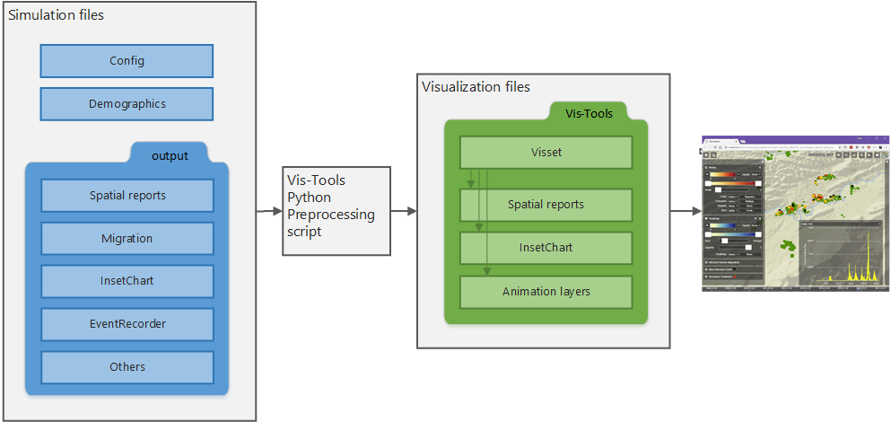
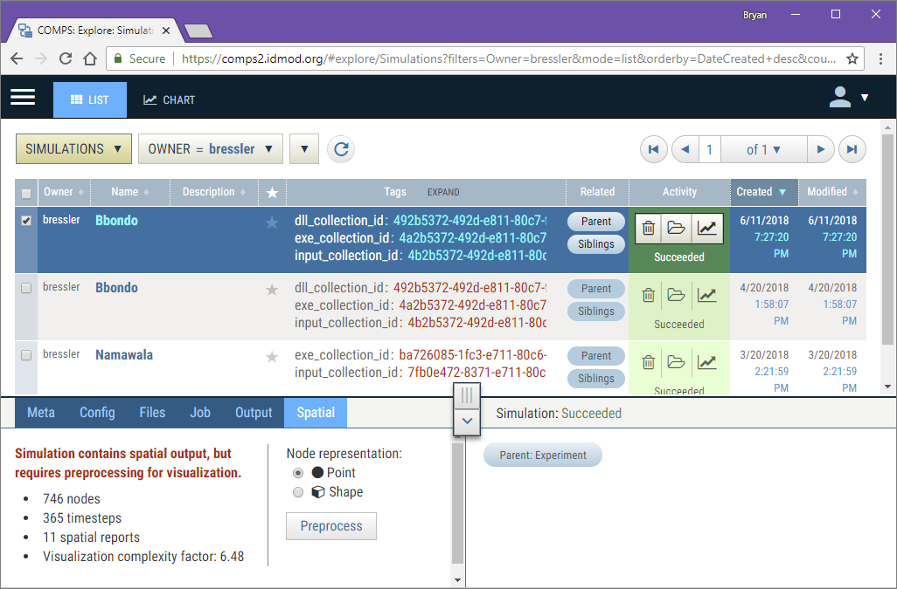

========
Overview
========

Welcome to the |IDM_s| |VT| visualization tool set. This page will provide an
overview of the structure of |VT| and the inter-operation of its parts. The
following pages will provide information on the use of |VT| for advanced
simulation data visualization.

Structure
=========

|VT| can be invoked either from the |COMPS_s| web client or for more advanced
use, run on your local computer. When used standalone, the |VT| files can reside
wherever convenient.

Vis-Tools consists of two main parts - a Python package that allows you to
preprocess |EMOD_s| simulation inputs and outputs into a "visset" file, and a
browser-based client to allow visualization of the simulation data. For
standalone use, |VT| also contains a simple Python web server that you run to
serve up the HTML visualization component.

  Structure of |VT|.

|COMPS_s| usage
===============

For spatial simulations run within the |COMPS_s| system, |VT| can be invoked
from the Spatial tab of |COMPS_s|' explore view.

  COMPS Explore view with Spatial tab showing in details.

For more information about running |VT| from |COMPS_s|, see the :doc:`intro`.

Python preprocessing
====================

The |VT| visualization client uses a :term:`visset` file that describes how the
simulation data is to be displayed and contains a subset of the simulation's
demographics data (specifically, information about its nodes). The visset file
is obtained by running a preprocessing script on your simulation's input and
output files.

You can write this preprocessing script from scratch, but more likely you'll let
|VT| create one for you. The |VT| ``survey`` program can look at your input and
output files and create a default preprocessing script to get you started.

The preprocessing script will have at least one output, which is the visset JSON
file. That file will likely reference files in your simulation's output folder
as well.

Visset
======

The visset file contains references to all the files necessary to visualize your
simulation. It also includes the default settings for the visualization client
page. If you so desire, you can have more than one visset for your simulation,
perhaps to highlight different aspects of the simulation's output.

Local web server
================

If you are running |VT| standalone, the data to be visualized will already be on
your local computer. In order to serve that data up to the visualization client,
|VT| contains a simple Python web server. This web server is by default on port
8000 of your own computer, "localhost".

Clients
=======

|VT| is designed to support multiple visualization clients. Currently, however,
there is only one client, called "Geospatial," which is primarily designed for
the visualization of spatio-temporal simulation output. In the future other
clients will be provided for different data visualization scenarios.
