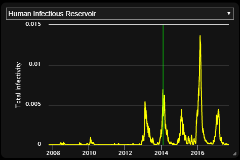
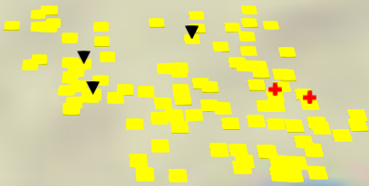

====================================
Components of a preprocessing script
====================================

Here we will look at a generated preprocessing script and break it down into
parts.

.. contents:: Contents
   :local:

The following script is the default script created by :term:`survey` for the built-in
demonstration data (``zambia_data``) that comes with |VT|.

.. code-block:: python

    # Generated by Survey.py

    # This script is meant to be run from within the target simulation directory.

    import time as tm
    from os import path, getcwd
    from vis_tools import VisSet, SpatialBinary, SpatialReports

    # Constants
    k_name = path.basename(getcwd())
    k_sim_dir = r'.'
    k_sim_output_dir = r'.\output'
    k_products_dir = path.join(k_sim_dir, path.relpath(path.dirname(path.abspath(__file__)), getcwd()))
    k_demographics_path_or_list = r'.\Bbondo_filled_calib_29.842464_prop.json'
    k_sim_url_root = '/' + path.basename(getcwd()) + '/'
    k_spatial_report_dir = k_sim_output_dir
    k_config_path = r'.\config.json'
    k_event_recorder_path = r'.\output\ReportEventRecorder.csv'
    k_human_migration_path = r'.\output\ReportHumanMigrationTracking.csv'
    k_malaria_filtered_path = r'.\output\ReportMalariaFiltered.json'

    # Appearance-related constants
    k_icon_duration_days = 2

    # ==============================================================================
    # Main program
    #
    # This Vis-Tools preprocessing program contains various useful examples in the
    # form of comments. Whenever possible the examples are made to be valid for the
    # present simulation, but in some cases you may have to modify the examples to
    # be valid in your context. Note that in this script you can override any option
    # or default value you see in defaultvisset.json.
    # ==============================================================================
    if __name__ == '__main__':
        script_start = tm.time()

        # Create a default VisSet
        vis_set = VisSet(k_name)

        # Set up the VisSet
        vis_set.set_target_client('Geospatial')
        vis_set.set_products_directory(k_products_dir)
        vis_set.set_config(k_config_path)
        vis_set.set_demographics(k_demographics_path_or_list)
        vis_set.set_node_vis_type('Points')

        # Remove the 'elsewhere' node from the node stats. This doesn't remove the
        # node, just leaves it out of min/max stats. Do this before adding the
        # spatial binaries, so as to also exclude that node from the spatial stats.
        # vis_set.exclude_node_from_stats(1001)

        # Inset chart
        vis_set.set_inset_chart(k_malaria_filtered_path)
        # vis_set.options['insetCharts']['defaultChannelName'] =
        #     'Infectious Vectors'

        # Add extra NodeAttribute fields
        vis_set.add_node_field('InitialPopulation')
        # vis_set.add_node_field('BirthRate')

        # Create a SpatialReports object that scans the simulation output directory
        # looking for SpatialReport_*.bin files. Later we'll add this to the VisSet
        # object.
        reports = SpatialReports(k_spatial_report_dir)

        # Example of creating an infected vectors count spatial binary by combining
        # SpatialReport_Adult_Vectors with SpatialReport_Infectious_Vectors. Once
        # created, we manually add the new report to the reports object
        # def combine(a, b):
        #     return int(a * b)
        # print('Synthesizing Infectious Vectors Count spatial binary...')
        # infected_vectors_count = SpatialBinary.combine(
        #     path.join(k_spatial_report_dir, 'SpatialReport_Adult_Vectors.bin'),
        #     path.join(k_spatial_report_dir, 'SpatialReport_Infectious_Vectors.bin'),
        #     'Infectious Vectors Count',
        #     combine)
        # report_path = path.join(k_products_dir,
        #     'SpatialReport_Infectious_Vectors_Count.bin')
        # infected_vectors_count.write_binary(report_path)
        # reports.add(report_path)

        # Add spatial reports (also establishes timestep count)
        vis_set.add_spatial_reports(reports)

        # Include only a subset of available spatial reports. If you have a lot of
        # spatial reports, you may run out of memory on the client side. So here you
        # can easily decide which channels are important and include just those
        # channels. All available channels are shown below, so just delete the lines
        # for channels you don't care about.
        vis_set.include_spatial_channels([
            'SpatialReport_Adult_Vectors',
            'SpatialReport_Daily_Bites_Per_Human',
            'SpatialReport_Daily_EIR',
            'SpatialReport_Human_Infectious_Reservoir',
            'SpatialReport_Infectious_Vectors',
            'SpatialReport_Infectious_Vectors_Count',
            'SpatialReport_Mean_Parasitemia',
            'SpatialReport_New_Clinical_Cases',
            'SpatialReport_New_Diagnostic_Prevalence',
            'SpatialReport_New_Infections',
            'SpatialReport_Population',
            'SpatialReport_Prevalence'
        ])

        # Infected human migration (do this after adding spatial reports)
        vis_set.set_event_recorder(k_event_recorder_path)
        vis_set.add_infected_human_migrations(k_human_migration_path)

        # Add event marker layers
        # vis_set.add_marker_layer('Received_Treatment',
        #                          marker=VisSet.k_marker_shape_triangle,
        #                          color='green')
        # vis_set.add_marker_layer('NewInfectionEvent',
        #                          marker=VisSet.k_marker_shape_triangle,
        #                          color='blue')

        # Other option overrides
        # vis_set.options['defaultBaseLayer'] = 'ESRI National Geographic'
        vis_set.hide_layer('heatmapVis')

        # Example bindings (NOTE: You may or may not have these sources available.
        # You will have to modify these examples to utilize your available sources.)
        # vis_set.add_binding('nodeVis', 'pointSize',
        #                     'InitialPopulation', 'scale(3, 16)')
        # vis_set.add_binding('nodeVis', 'pointColor',
        #                     'SpatialReport_Prevalence', 'sampleGradient()')
        # vis_set.add_binding('heatmapVis', 'source',
        #                     'SpatialReport_Infectious_Vectors_Count', 'none()')

        # Consistency check
        vis_set.validate()

        # Emit VisSet
        vis_set.write_as('visset.json', k_sim_url_root)

        # Emit URL
        print('When using the standalone Vis-Tools server, use the following URL:')
        visset_path = path.join(k_products_dir, 'visset.json').replace('\\', '/')
        visset_path = visset_path.replace('./', k_sim_url_root)
        print('http://localhost:8000/vistools/geospatial.html?set=%s' % visset_path)

        # Done
        script_end = tm.time()
        print('\nElapsed time %.2f seconds' % float(script_end - script_start))

Imports and constants
=====================

.. code-block:: python

    # Generated by Survey.py

    # This script is meant to be run from within the target simulation directory.

    import time as tm
    from os import path, getcwd
    from vis_tools import VisSet, SpatialBinary, SpatialReports

    # Constants
    k_name = path.basename(getcwd())
    k_sim_dir = r'.'
    k_sim_output_dir = r'.\output'
    k_products_dir = path.join(k_sim_dir, path.relpath(path.dirname(path.abspath(__file__)), getcwd()))
    k_demographics_path_or_list = r'.\Bbondo_filled_calib_29.842464_prop.json'
    k_sim_url_root = '/' + path.basename(getcwd()) + '/'
    k_spatial_report_dir = k_sim_output_dir
    k_config_path = r'.\config.json'
    k_event_recorder_path = r'.\output\ReportEventRecorder.csv'
    k_human_migration_path = r'.\output\ReportHumanMigrationTracking.csv'
    k_malaria_filtered_path = r'.\output\ReportMalariaFiltered.json'

    # Appearance-related constants
    k_icon_duration_days = 2

This section imports some built-in Python classes and a few of the |VT| classes
as well.

* ``VisSet`` is a wrapper class for the output :term:`visset` file. Most of the
  preprocessing script revolves around populating and making method calls on
  a ``VisSet`` object.

* ``SpatialBinary`` is a wrapper class for an |EMOD_s| spatial binary report, which
  generally ends with the file extension .bin. (The file format for those
  files is documented in
  `Spatial output report <www.idmod.org/docs/general/file-spatial.html>`_.

* ``SpatialReports`` is a collection class that surveys and manages the list of
  spatial reports found (typically) in a simulation's output directory.

Next the script defines some constants with file paths.

Finally, ``k_icon_duration_days`` controls how long marker
icons show up in marker layers. This is described in more detail in
:ref:`marker-layers` below.

Setup of the VisSet object
==========================

.. code-block:: python

    # ==============================================================================
    # Main program
    #
    # This Vis-Tools preprocessing program contains various useful examples in the
    # form of comments. Whenever possible the examples are made to be valid for the
    # present simulation, but in some cases you may have to modify the examples to
    # be valid in your context. Note that in this script you can override any option
    # or default value you see in defaultvisset.json.
    # ==============================================================================
    if __name__ == '__main__':
        script_start = tm.time()

        # Create a default VisSet
        vis_set = VisSet(k_name)

        # Set up the VisSet
        vis_set.set_target_client('Geospatial')
        vis_set.set_products_directory(k_products_dir)
        vis_set.set_config(k_config_path)
        vis_set.set_demographics(k_demographics_path_or_list)
        vis_set.set_node_vis_type('Points')

This section begins the main program. First it creates a ``VisSet`` object. This
object, at the end of the program, is emitted as a visset.json file.

Next the ``VisSet`` object is populated with some basic information.

* ``set_target`` indicates which visualization client the ``VisSet`` is targeting.
  Currently there is only one visualization target: ``Geospatial``. Subsequent
  versions of |VT| will have additional visualization clients.

* ``set_products_directory`` tells the ``VisSet`` the directory to which to
  write its products (e.g. the visset.json file, animation layer files, etc.)
  The products directory helps keep preprocessing outputs from polluting your
  simulation directory, and helps isolate them from other users who might also
  visualize your simulation with |VT|.

* ``set_config`` tells the ``VisSet`` the path to the simulation configuration
  JSON file, which is typically named config.json.

* ``set_demographics`` tells the ``VisSet`` the file path to the simulation's
  demographics file (or an array of filenames, if so specified in the
  config.json file). The ``VisSet`` will open and digest the node data here as
  well.

* ``set_node_vis_type`` tells the ``VisSet`` what node representation to use:
  two-dimensional points or three-dimensional shapes, as described in
  :ref:`points-shapes`.

Drop a node from statistics
===========================

.. code-block:: python

      # Remove the 'elsewhere' node from the node stats. This doesn't remove the
      # node, just leaves it out of min/max stats. Do this before adding the
      # spatial binaries, so as to also exclude that node from the spatial stats.
      # vis_set.exclude_node_from_stats(1001)

This code, which is commented out by default, shows how to drop a node from the
min/max statistics. This is specifically for handling simulations that use an
"elsewhere" node in migrations, as mentioned in the comments, to keep such a
node from skewing population and other ranges. Multiple nodes can also be
excluded with ``vis_set.exclude_nodes_from_stats``.

.. _insetchart:

Inset chart
===========

.. code-block:: python

    # Inset chart
    vis_set.set_inset_chart(k_malaria_filtered_path)
    # vis_set.options['insetCharts']['defaultChannelName'] =
    #     'Infectious Vectors'

This section associates an inset chart file with the VisSet. The inset charts
file typically contains aggregated information about the simulation. When an
inset chart file is attached, the visualization will have an inset chart panel,
which looks like this:

The inset panel will include all the channels in the associated inset chart
file.

It is common for |EMOD_s| simulations to emit a file called ``InsetChart.json``,
but for |VT|, any file with the same format as an inset chart file will work.
For example, some malaria simulations emit a ``ReportMalariaFiltered.json``
file, which has the same format as ``InsetChart.json``. In our example
preprocessing script, ``survey`` did not find an ``InsetChart.json`` file, but
did find ``ReportMalariaFiltered.json``, so it included that as the inset file.

To learn more about the format of inset chart files, see
`Inset chart output report <www.idmod.org/docs/general/file-inset-chart.html>`_.

Extra node attributes
=====================

.. code-block:: python

    # Add extra NodeAttribute fields
    vis_set.add_node_field('InitialPopulation')
    # vis_set.add_node_field('BirthRate')

This bit of code lets us take elements of the demographics file's **NodeAttributes**
and copy them into the ``VisSet`` abbreviated node data. By default |VT| keeps
only the following information about nodes:

* Latitude
* Longitude
* Altitude (if present)

You can call the ``VisSet add_node_field`` method to take additional fields from
the **NodeAttribute** section of the node's demographic data. For example, to also
retain the **BirthRate NodeAttribute**, you would add::

    vis_set.add_node_field('BirthRate')

Retained NodeAttribute fields aren't limited to numeric fields. You can include
text fields too, such as names, catchment areas, or regional identifiers that
you may have added to your demographics file.

Creation of a new spatial binary
================================

.. code-block:: python

    # Create a SpatialReports object that scans the simulation output directory
    # looking for SpatialReport_*.bin files. Later we'll add this to the VisSet
    # object.
    reports = SpatialReports(k_spatial_report_dir)

    # Example of creating an infected vectors count spatial binary by combining
    # SpatialReport_Adult_Vectors with SpatialReport_Infectious_Vectors. Once
    # created, we manually add the new report to the reports object
    # def combine(a, b):
    #     return int(a * b)
    # print('Synthesizing Infectious Vectors Count spatial binary...')
    # infected_vectors_count = SpatialBinary.combine(
    #     path.join(k_spatial_report_dir, 'SpatialReport_Adult_Vectors.bin'),
    #     path.join(k_spatial_report_dir, 'SpatialReport_Infectious_Vectors.bin'),
    #     'Infectious Vectors Count',
    #     combine)
    # report_path = path.join(k_products_dir,
    #     'SpatialReport_Infectious_Vectors_Count.bin')
    # infected_vectors_count.write_binary(report_path)
    # reports.add(report_path)

First |VT| creates a reports variable that contains a collection of spatial
reports (SpatialReport_*.bin) found in the simulation's output directory. This
list is established so that we can, if so desired, create additional reports to
add to the collection.

|VT| is not just a visualization technology; it is also a toolset. This next
section of code (which is commented out) shows how you can use |VT| to create
a new spatial report by combining two existing reports. This example multiplies
Adult Vectors by Infections Vectors to obtain Infectious Vector Count, then
writes that data to a new spatial report binary file.

.. note::

    The simulation's spatial reports reside in the simulation's output
    directory. New spatial reports created using ``combine`` are instead put
    in the products directory, to avoid polluting the simulation's original
    data.

Inclusion of spatial reports
============================

.. code-block:: python

    # Add spatial reports (also establishes timestep count)
    vis_set.add_spatial_reports(reports)

    # Include only a subset of available spatial reports. If you have a lot of
    # spatial reports, you may run out of memory on the client side. So here you
    # can easily decide which channels are important and include just those
    # channels. All available channels are shown below, so just delete the lines
    # for channels you don't care about.
    vis_set.include_spatial_channels([
        'SpatialReport_Adult_Vectors',
        'SpatialReport_Daily_Bites_Per_Human',
        'SpatialReport_Daily_EIR',
        'SpatialReport_Human_Infectious_Reservoir',
        'SpatialReport_Infectious_Vectors',
        'SpatialReport_Infectious_Vectors_Count',
        'SpatialReport_Mean_Parasitemia',
        'SpatialReport_New_Clinical_Cases',
        'SpatialReport_New_Diagnostic_Prevalence',
        'SpatialReport_New_Infections',
        'SpatialReport_Population',
        'SpatialReport_Prevalence'
    ])

This section starts by calling the VisSet ``add_spatial_reports`` method to add
the spatial reports (including any you may have synthesized) to the VisSet.

The VisSet ``include_spatial_channels`` call has a list of spatial channels that
were present when ``survey`` was run. This call is here to allow you to remove
some channels that you don't need, in case you run out of memory in the
:term:`Geospatial client`. You can simply comment out any reports to which you
don't need access.

Infected human migration
========================

.. code-block:: python

    # Infected human migration (do this after adding spatial reports)
    vis_set.set_event_recorder(k_event_recorder_path)
    vis_set.add_infected_human_migrations(k_human_migration_path)

This section creates an Infected Human Migrations animation layer for the
visualization. To create that animation, the ``VisSet`` needs both the
ReportEventRecorder.csv and the ReportHumanMigrationTracking.csv report.
It combines the information in those two sources to find migrations of only
*infected* individuals and adds them to the animation layer.

.. note::

    The Infected Human Migrations animation layer is written to a file called
    InfectedMigrations.czml in the products directory.

.. note::

    If your simulation lacks either an ReportEventRecorder.csv or a
    ReportHumanMigrationTracking.csv file, ``survey`` won't emit any code for
    preprocessing the Infected Human Migrations animation.

.. _marker-layers:

Marker layers
=============

.. code-block:: python

    # Add event marker layers
    # vis_set.add_marker_layer('Received_Treatment',
    #                          marker=VisSet.k_marker_shape_triangle,
    #                          color='green')
    # vis_set.add_marker_layer('NewInfectionEvent',
    #                          marker=VisSet.k_marker_shape_triangle,
    #                          color='blue')

A *marker layer* is a type of animation that creates markers near nodes when
particular events occur in the ``ReportEventRecorder.csv``.

To add a marker layer, you call the ``VisSet add_marker_layer`` method,
passing the name of the event, as well as the marker shape and color. For more
information about adding marker layers, see :py:class:`vis_tools.VisSet`.

.. note::

    Marker layers are generated as new ``.czml`` files that are written to the
    products directory.

Options and bindings
====================

.. code-block:: python

    # Other option overrides
    # vis_set.options['defaultBaseLayer'] = 'ESRI National Geographic'
    vis_set.hide_layer('heatmapVis')

    # Example bindings (NOTE: You may or may not have these sources available.
    # You will have to modify these examples to utilize your available sources.)
    # vis_set.add_binding('nodeVis', 'pointSize',
    #                     'InitialPopulation', 'scale(3, 16)')
    # vis_set.add_binding('nodeVis', 'pointColor',
    #                     'SpatialReport_Prevalence', 'sampleGradient()')
    # vis_set.add_binding('heatmapVis', 'source',
    #                     'SpatialReport_Infectious_Vectors_Count', 'none()')

This section starts by calling the ``VisSet hide_layer`` method to make it so
that when the visset is loaded by the |VT| Geospatial client, the heatmap layer
will be turned off (unchecked) by default.

This is an example of a customization you can make on the preprocessing side
that sets the initial state of the visset when it is loaded into the client.

The code below that shows examples of adding bindings between visual parameters
and simulation data channels. For more on bindings, see :doc:`geospat`.

.. note::

    There are many options and styles you can override in your preprocessing
    script. To see the defaults, and what options and styles are available, look
    at the defaultvisset.json file in the |VT| directory.

    For example, here is a small section of defaultvisset.json::

          "defaultOptions": {
            "Geospatial": {
              "defaultAltitudeM": 1,
              "defaultBaseLayer": "Bing Maps Aerial",
              "clockStepDurationSecs": 14400,
              "clockInitialTimestep": 0,
              "clockAutoRun": false,

    If you wanted to change the base map used in your visualization to a
    road-style map instead of a satellite map, you could add the following line
    to your preprocessing script::

        visset.options["defaultBaseLayer"] = "OpenStreetMap"

.. _finish:

Finish preprocessing
====================

.. code-block:: python

    # Consistency check
    vis_set.validate()

    # Emit VisSet
    vis_set.write_as('visset.json', k_sim_url_root)

    # Emit URL
    print('When using the standalone Vis-Tools server, use the following URL:')
    visset_path = path.join(k_products_dir, 'visset.json').replace('\\', '/')
    visset_path = visset_path.replace('./', k_sim_url_root)
    print('http://localhost:8000/vistools/geospatial.html?set=%s' % visset_path)

    # Done
    script_end = tm.time()
    print('\nElapsed time %.2f seconds' % float(script_end - script_start))

The last part of the preprocessing script calls the VisSet ``validate`` method
to check it for consistency, then writes the visset file to the products directory.

.. note::

    You can have as many visset files as you want for a given simulation. It may
    make sense to do that if you have different aspects of your simulation that
    you wish to demonstrate, each requiring a specific visual presentation.

    To do this, make copies of your preprocessing script with the various
    customizations you want, and modify each scripts' ``write_as`` call to use
    a different file name. After you run all of them, you'll have multiple
    visset files in your products directory, which you can point to using the
    URL parameter ``set=`` as shown above.

