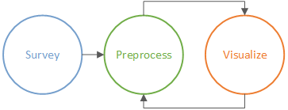
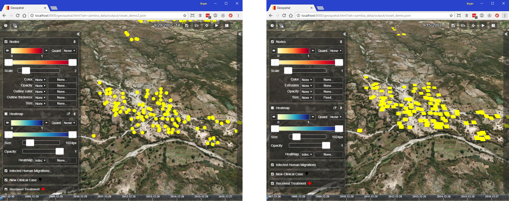

===================
Preprocessing cycle
===================

It may be useful to think of using |VT| as a cycle.

#.  Run ``survey`` on your simulation data to generate a preprocessing script.
#.  Run the preprocessing script (which will be in the |VT| folder) to generate
    a :term:`visset` file.
#.  Browse to the URL printed by the preprocessing script
    (http://localhost:8000/...) and evaluate the visualization.
#.  Modify the preprocessing script to suit your liking, then go back to step 2.

This page is mostly concerned with generating, running, and modifying the
preprocessing script. The visualization step is covered in detail in
:doc:`geospat`.

.. contents:: Contents
   :local:

Create a default preprocessing script
=====================================

While it is possible to write a preprocessing script from scratch using the
Python classes provided in |VT|, typically you will let the ``survey`` program
generate a default preprocessing script for you, and then customize that script
to your liking.

``survey`` looks at the available data in your simulation folder and emits a
preprocessing script for you, which varies depending on what data your
simulation contains. For example, if your simulation contains both files
ReportHumanMigrationTracking.csv and ReportEventRecorder.csv, ``survey``
will emit code that creates an animation layer for infected human migration.

Here is the command-line usage for the ``survey`` program:

.. code-block:: bash

    usage:

    To create a preprocessing script for a simulation:
    survey -i <sim_dir> -o <out_py_file> -t <Points|Shapes>

    To update an existing visset.json with Asset Manager URLS:
    survey -i <visset_path> -a <asset_map_path>

    Survey generates Vis-Tools preprocessing scripts or updates existing
    visset.json files with COMPS Asset Manager URLs.

    optional arguments:
      -h, --help            show this help message and exit
      -a ASSET_MAP_PATH, --assetmap ASSET_MAP_PATH
                            Path to a VtAssetMap.json file.
      -d DEMOGRAPHICS_PATH, --demographics DEMOGRAPHICS_PATH
                            Full path to demographics file.
      -f, --force           Write new preprocessing script even if one already
                            exists with the same MD5.
      -i SIM_DIR, --input SIM_DIR
                            Directory containing simulation input and output
                            files, or to a visset.json for update.
      -o OUT_FILE, --output OUT_FILE
                            Output script path.
      -p PRODUCTS_DIR, --products PRODUCTS_DIR
                            Directory to be used for preprocessing output
                            products. If not specified, <sim_dir>/output/ will be
                            used.
      -s SIM_ID, --simid SIM_ID
                            Simulation ID.
      -t {Points,Shapes}, --type {Points,Shapes}
                            Value indicating node representation type.
      -v, --verbose         Emit extra messages for debugging and timing.
      -vv, --verbose-debug  Extra debug output.

The preprocessing scripts generated by ``survey`` are well-commented and contain
sections of commented-out code that show best practices for various
visualization scenarios, such as adding marker layers. Such best practices are
described in :doc:`preproc-components`.

.. note::

    For SIM_DIR and OUT_FILE arguments, use forward slashes (/) in any paths
    you specify there, e.g.::

        survey -i my_sim/run_1 -t Points

.. note::

    The output of ``survey`` is a new Python program. So if you use the ``-o`` switch
    the OUT_FILE should have a ".py" extension, e.g.::

        survey -i my_sim -t Points -o my_sim_prep.py

.. important::

    The ``survey`` program is meant to be run from *within a simulation directory.* For
    example, a typical usage might be::

        cd my\sim\sir
        survey -t Shapes

Run ``survey`` on your own simulation data
------------------------------------------

Follow the steps below to run the ``survey`` program on your own
simulation's data.

.. note::

    The only files strictly required for visualization are a demographics file
    with latitude and longitude locations for your nodes and either a) a configuration
    file or b) at least one spatial report output/SpatialBinary_xxx.bin.
    Either of those latter two files provide the simulation timestep duration.
    Climate files are not needed by |VT|.

#.  Copy your simulation's input and output data, including a demographics file
    and the output directory, into a new directory inside the |VT| directory.
    This is required because |VT| has its own local web server, which serves up
    only the |VT| directory, and your simulation's data needs to be among that.

    For this example, we assume the data is copied to a directory called
    my_sim within the |VT| directory.

#.  Open a command prompt window and ``cd`` to the simulation's directory within
    the |VT| directory, then run ``survey``::

        cd my_sim
        survey -t Points

#.  ``survey`` will emit a preprocessing Python script within the simulation
    directory called (by default) preprocess_sim.py. Because the ``-t Points``
    argument was specified on the command line, that preprocessing script will
    represent your simulation's nodes as two-dimensional points when run. For
    more on the difference between :term:`points` and :term:`shapes`,
    see :ref:`points-shapes`.

#.  (Optional) Open and modify the preprocessing script to customize it to meet
    your needs.

Run the preprocessing script
============================

Now that you created a default preprocessing script with ``survey``, you can
edit it to suit your needs or just run it as-is. Continuing with the "my_sim"
example above, to run the preprocessing script, use the command::

    python Vis-Tools\...\preprocess_sim.py

(Where "..." above denotes the MD5 hash directory.) Running the script will
generate a :term:`visset` at my_sim/Vis-Tools/.../visset.json. The output of the
preprocessing script shows the URL you will use to visualize the simulation. In
this example that will be::

    http://localhost:8000/geospatial.html?set=/my_sim/Vis-Tools/.../visset.json

(Where again "..." above denotes the MD5 hash directory.) Make note of the URL
from your simulation preprocessing output and continue to the next section.

Visualize the simulation
========================

#.  Ensure the local http server is running. See :ref:`server`.
#.  In a browser, paste in the URL emitted by your preprocessing script.

Once the |VT| Geospatial client page loads, you will see the yellow dots of your
simulation's nodes. For complete details on customizing the
:term:`Geospatial client`, see :doc:`geospat`.

.. _points-shapes:

Points versus shapes
====================

The |VT| Geospatial client can represent the nodes of your
simulation as either:

* Points, which are two-dimensional circles measured in pixels, or
* Shapes, which are three-dimensional rectangles measured in meters.

Those two representations have different visual parameters that you can bind to
the outputs of your simulation. Depending on what you want to show, and how many
simulation data channels you need to represent simultaneously, one of those may
benefit you more than the other.

    Point nodes (left) and shape nodes (right)

When you run ``survey``, you can indicate which representation you want. If you
don't specify a ``-t`` argument to the ``survey`` program, it will by default
create a preprocessing script using a points representation for nodes. However, it is
not difficult to change the script to use shapes instead if you change your mind.

For more information on the *points* and *shapes* representation of nodes, see
:doc:`geospat`.