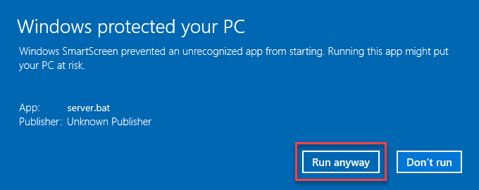

===============
Troubleshooting
===============

If you run into trouble while installing or using standalone |VT|, check to see
if your problem is listed here.

Command window message when double-clicking server.bat
======================================================

If server.bat can't run the python web server, it may show a diagnostic message.
This section clarifies those.

Python not in PATH
------------------

.. code-block:: batch

    Python is not in your PATH environment variable. Please re-run the Python
    installer and make sure 'Add python.exe to Path' is enabled in the 'Customize
    Python' page of the installer.

This message indicates that Python is not available to server.bat. The simplest
solution is to reinstall Python as described. Alternately, you can manually edit
the PATH environment variable to add the path to the Python executable.

Run from UNC location
---------------------

.. code-block:: batch

    It is likely that you have run server.bat from an Explorer window that is
    pointed at a UNC path (that is, one that starts with two \\). The windows
    command prompt does not support UNC paths. If the UNC path corresponds to a
    mapped drive, open an Explorer window to the mapped drive letter and try
    again. It is recommended that you unzip Vis-Tools to a local (non-network)
    location for best performance.

This message indicates that server.bat thinks you're running from a network
location. (It infers that from the current directory, which will be your Windows
directory if you try to run server.bat from a network location.) |VT| will not
run from a network share unless that share is *mapped* to a drive letter, like
"U:". If the network location is in fact mapped, open an Explorer window from
mapped drive letter, navigate to the |VT| directory, then run server.bat again.
If the location is not mapped, reinstall |VT| to a local (non-network) location
and try again.

Server Python file not in current directory
-------------------------------------------

.. code-block:: batch

    The server python file, server.py, is not present in the current directory.
    Please re-install Vis-Tools to a local ^(non-network^) location and try
    again.

This can happen if you were to run the server.bat file with the current
directory not set to the |VT| directory. It is safest to open an Explorer window
to the |VT| directory and double-click server.bat to run the web server.

Windows SmartScreen dialog when double-clicking server.bat
==========================================================

Windows SmartScreen may attempt to prevent you from running server.bat, which
is batch file.

If you see this dialog, click More Info, then click the Run Anyway button.

Socket.error starting web server
================================

If you get an exception when you run the local web server that looks like
this::

    C:\Vis-Tools>server.bat
    It appears that some other program is currently using port 8000. To use a
    different port, edit server.py and change the k_port constant to some other
    port, such as 8080. Or find and kill the program that is currently using
    port 8000.
    Press any key to continue . . .

This means that *some other* program is currently bound to port 8000. You can:

#. Find and terminate the other program currently binding port 8000, or

#. Change the ``k_port = 8000`` line in server.py to use some other,
   unused port.

Windows SmartScreen dialog when starting web server
===================================================

If, when you run the web server, you get a big blue dialog box from Windows:

    .. figure:: images/vt-protected.png

This indicates that your user account does not have sufficient permissions to
bind port 8000 to the web server. This may occur in highly-managed environments.
If you have the username and password for a local administrator account, you can
enter it into the dialog box. Otherwise, contact your local IT staff.

Running with an ad blocker
==========================

Vis-Tools has no advertising and has no telemetry whatsoever. Nevertheless, some
of the JavaScript libraries that Vis-Tools uses may be blocked by aggressive ad
blocking browser plugins.

Vis-Tools attempts to detect when crucial components are blocked by an ad
blocker and may display a page like the following:

    .. figure:: images/vt-ad-blocker.png

Whitelist the Vis-Tools client page in your ad blocker, then click the Reload
button and visualization should proceed.

Geospatial web page never finishes loading
==========================================

You can get the web server running, but when it tries to load the demo
:term:`Geospatial client`, it gets stuck with a spinning **Loading** indicator

    .. figure:: images/vt-loading.png

Generally this means an error occurred while the page was loading. This can be
caused by a variety of problems, but the most common one is that the web browser
ran out of memory.

Try closing *all* instances of the web browser on your computer, and stop the web server if it is
running. Then re-run the web server by double-clicking server.bat. When server.bat runs the server
and launches the browser, it uses special flags that allow the browser to use more memory, but this
only works if there aren't windows or tabs already open. Thus, letting server.bat open your first
browser window may solve the spinning **Loading** problem.
